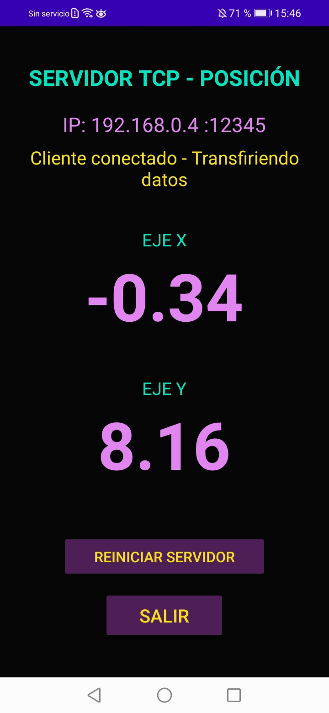
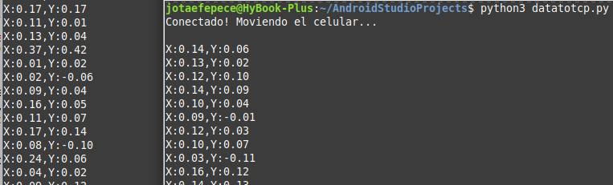

# 🐛Wormux Data Tools🐛 

Colección de herramientas TCP para pruebas, experimentación… 
y un poco de caos.

---

## Herramientas

- **XPaTCPfull**  
  Comunicación TCP 1 a 1

- **dataXYaTCP**  
  Envío de datos a múltiples clientes (1 a muchos)

- **WormuxTCP**  
  Envío de mensajes aleatorios con tiempos aleatorios por cliente

---

## Descargas

Descargar APKs:

- [⬇️ XPaTCPfull](Apps/XPaTCPfull.apk)  
- [⬇️ dataXYaTCP](Apps/dataXYaTCP.apk)  
- [⬇️ WormuxTCP](Apps/WormuxTCP.apk)  

---

## Capturas

|  Envío desde celular |  Recepción en terminal   |
|----------------------|--------------------------|
|  |  |

|  Modo Wormux  |  Iconos  |
|---------------|----------|
|  |  |

---

## Propósito

- Pruebas de red  
- Aprendizaje de TCP/IP  
- Experimentos con múltiples clientes  
- Caos controlado 😄😄😄  

---

## Nota

Proyecto con fines educativos y experimentales.

---
