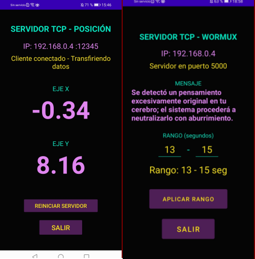

# 🐛Wormux Data Tools🐛 

Colección de herramientas TCP para pruebas, experimentación… 
y un poco de caos.

---

## Herramientas

- **XPaTCPfull**  
  Comunicación TCP 1 a 1

- **dataXYaTCP**  
  Envío de datos a múltiples clientes (1 a muchos)

- **WormuxTCP**  
  Envío de mensajes aleatorios con tiempos aleatorios por cliente

---

## Descargas

Descargar APKs:

- [⬇️ XPaTCPfull](Apps/XPaTCPfull.apk)  
- [⬇️ dataXYaTCP](Apps/dataXYaTCP.apk)  
- [⬇️ WormuxTCP](Apps/WormuxTCP.apk)  

---


## Capturas

|  Envío desde celular |  Recepción en terminal   |
|----------------------|--------------------------|
|  |  |

|   Modo Wormux   |  Modo data XY  |
|-----------------|----------------|
|  |  |

---

## Test para ejecución con python3:
```import socket
 # Cambiar IP por la que ofrece la aplicación del celular...
HOST = "192.168.0.4" 
PORT = 5000  ## Cambiar puerto según App

with socket.socket(socket.AF_INET, socket.SOCK_STREAM) as s:
    s.connect((HOST, PORT))
    print("Conectado! Moviendo el celular...\n")

    while True:
        data = s.recv(1024).decode('utf-8').strip()
        if data:
            print(data)
```


---

## Propósito

- Pruebas de red  
- Aprendizaje de TCP/IP  
- Experimentos con múltiples clientes  
- Caos controlado 

---

## Nota

Proyecto con fines educativos y experimentales.

---
